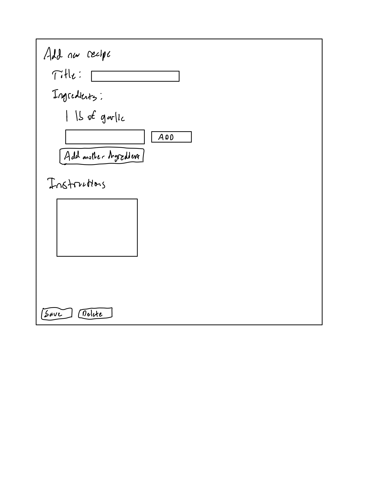
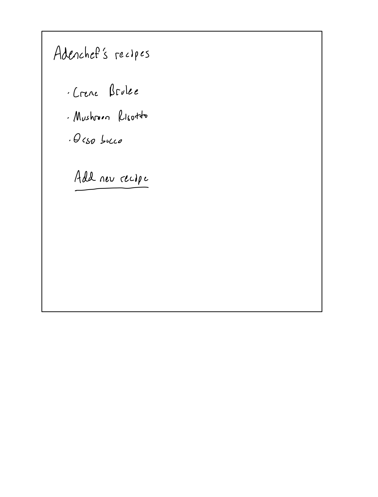
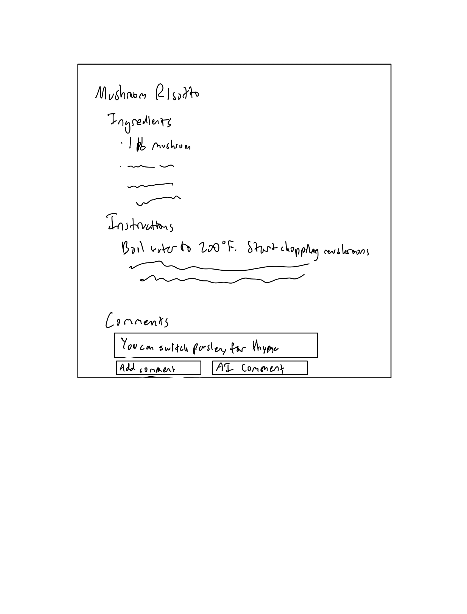
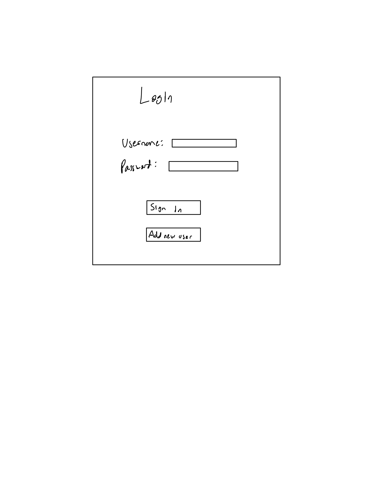
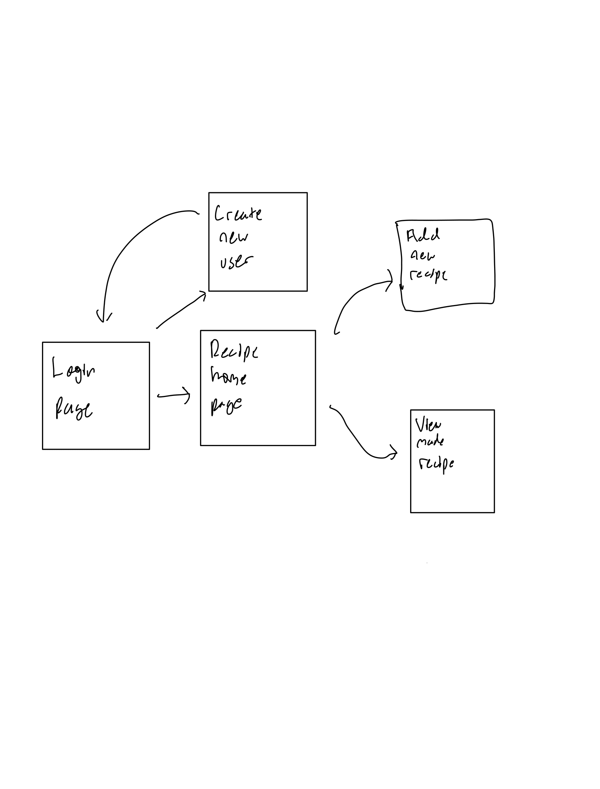

# Yum Yum Recipes

## Overview

For this project I will be creating a website that can store recipes for users.  They will be able to input the ingredients, the amount of each ingredient, and the instrcutions to create a dish.  Users will also be allowed to comment on the recipes for any changes in ingredients or instructions that they found worked better.


## Data Model

The application will store recipes, ingredients, instructions, and comments

users can have multiple recipes (via references)
each list can have multiple ingredients and instructions (by embedding)

An Example Recipe:

```javascript
{
  Author: "adenchef",
  ingredients: // a bullet pointed list of ingreadients with amounts
  instructions: // a paragraph of detailed instrcutions for the recipe
  comments: // a forum style list of comments
}
```

An Example homepage:

```javascript
{
  username: "adenchef's recipes",
  recipes: // a list of recipes that have been written by the user
}
```

An Example login page:

```javascript
{
  username: "adenchef",
  pasword: "*********"
}
```

An Example new user page:

```javascript
{
  username: "adenchef",
  pasword: "*********",
  confirmpasword: "*********"
}
```


## [Link to Commented First Draft Schema](db.mjs) 

This is the link to the first draft of my schemas


## Wireframes


/recipe/create - page for creating a new recipe



/recipe - page for showing all recipes



/recipe/mushroomrisotto - page for showing specific recipes



/login - page for logging in



/login - new user creation page


## Site map

My site map is linked here



## User Stories or Use Cases

1. as non-registered user, I can register a new account with the site
2. as a user, I can log in to the site
3. as a user, I can create a new recipe
4. as a user, I can view all of the recipes I have made
5. as a user, I can comment on a previously made recipe
6. as a user, I can use ChatGPT to give advice on how to improve a recipe
7. as a user, I can edit a previously created recipe

## Research Topics

* (6 points) Front end framework
    * I'm going to be using react for the front end framework
    * I will use it to create the page's formats in the js files
* (2 points) External API
    * I will use ChatGPT
    * A user can send in a recipe to be commented on
    * ChatGPT will give advice on how to improve the recipe
* (2 points) Bootstrap
    * I will use Bootstrap to give my css a theme
    * Will improve the UI and make it more pleasant to view

10 points total out of 10 required points

## [Link to Initial Main Project File](app.mjs) 

This is the link to my inital app initialization
[LinkToInitialProject](app.mjs)

## Annotations / References Used

1. I haven't used any references yet but I will use them to get a better grasp on Bootstrap and React when I am actually coding the project.

